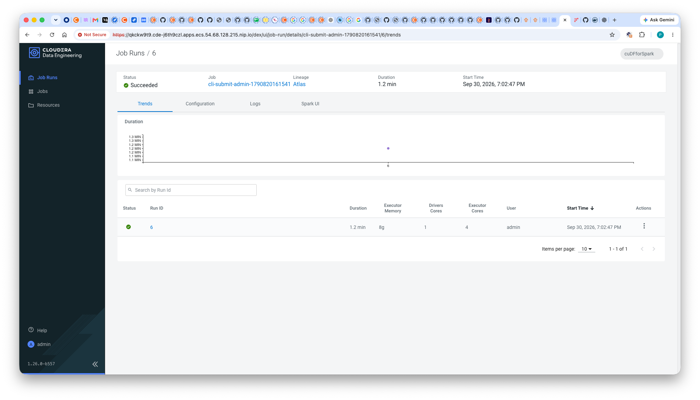

# Running Spark RAPIDS on CDE 1.26 with a patched custom runtime

End-to-end runbook for the route that **works**: build a CDE custom runtime image containing the OSS
Spark RAPIDS jar with two of its classes recompiled against this cluster's own Spark, register it as a
CDE resource, and submit a GPU job. No virtual-cluster recreate, no Cloudera entitlement, no GPU base
image.

This exists because CDE 1.26's own GPU runtime images are not published to any registry this cluster
can reach (`README.md` §6) **and** the OSS RAPIDS jar cannot link against Cloudera's Spark unmodified.
The second problem is the one this document solves.

Internal technical prototype. The image contains a modified third-party artifact — see
[`../runtime/README-patch.md`](../runtime/README-patch.md) before sharing it.

---

## 1. Exact versions

Every string here was read off the running cluster or out of the job's own driver log, not from
release notes. The patch is **specific to the Spark build**, so these matter.

| | Exact string |
|---|---|
| Private Cloud (CDP PVC) | **`1.5.5-h3000`** — Community Edition, ECS / RKE2 `v1.33.12` |
| Cloudera Manager | **`7.13.2.6`** |
| CDP Runtime | **`7.3.2.0`** |
| CDE service version | **`1.26.0-b557`** (bottom-left of the CDE UI; `cde-j6th9czl`) |
| Spark | **`3.5.4.1.26.732.0-45`** |
| Hadoop (client, in-image) | `3.4.2.7.3.2.0-957` |
| Hive Warehouse Connector | `1.0.0.1.26.732.0-45` |
| Scala | `2.12.19` |
| **CDE base runtime image** | **`docker-private.infra.cloudera.com/cloudera/dex/dex-spark-runtime-3.5.4-7.3.2.0:1.26.0-b557`** |
| Same image, as the cluster resolves it | `container.repository.cloudera.com/cdp-private/cloudera/dex/dex-spark-runtime-3.5.4-7.3.2.0:1.26.0-b557` |
| RAPIDS jar | `com.nvidia:rapids-4-spark_2.12:26.02.0`, `cuda12` classifier |
| Published runtime image | `pauldefusco/cde-rapids-runtime-3.5.4:26.02.0-p1` |
| CDE service / VC | `cluster-j6th9czl` / `cuDFforSpark` (vcId `qkckw9t9`) |
| GPU workers | 3 × `g5.8xlarge`, 1× NVIDIA A10G 24 GB each, RHEL 9.6 **amd64**, driver 615.71.09 / CUDA 13.4 |

**Read the base image tag off your own cluster rather than copying it.** The repo name carries the
*Runtime* line and the tag carries the *CDE* version — they move independently:

```bash
kubectl get cm <vcId>-api-cm -n <vcId> -o jsonpath='{.data.dex\.yaml}' | grep -E 'image:|Image:'
```

A custom runtime must be built `FROM` the CDE runtime base for the same CDE version. Mixing versions
is what this whole document is about.

---

## 2. The defect, in three lines

Cloudera's `3.5.4.1.26.732.0-45` added a **defaulted** 6th constructor parameter to
`org.apache.spark.rdd.MapPartitionsRDD` — `isDeterministic: Option[Boolean]`. Defaulted means
*source*-compatible but **binary**-incompatible: the call site bakes the full descriptor into bytecode,
so a class compiled against Apache Spark emits a 7-arg call that no longer exists. Every GPU plan dies
at the first action, because the call site is `GpuExec.doExecuteColumnar` — the base method for *every*
GPU operator:

```
java.lang.NoSuchMethodError: 'void org.apache.spark.rdd.MapPartitionsRDD.<init>(
    org.apache.spark.rdd.RDD, scala.Function3, boolean, boolean, boolean,
    scala.reflect.ClassTag, scala.reflect.ClassTag)'
  at org.apache.spark.rapids.LocationPreservingMapPartitionsRDD.<init>(…:44)
  at com.nvidia.spark.rapids.GpuExec.doExecuteColumnar(GpuExec.scala:341)
```

**Because the parameter is defaulted, recompiling the unmodified upstream source fixes it** — the
compiler supplies the default and emits the 8-arg call by itself. No RAPIDS logic changes. Exactly
**2 classes of 17,833** in the jar call that constructor. Full reasoning, provenance and verification:
[`../runtime/README-patch.md`](../runtime/README-patch.md).

This is a **build-window** problem, not a Cloudera-fork-wide one — 7.2.18 links fine, as does every
Apache release. See [`oss-rapids-vs-cloudera-spark.md`](oss-rapids-vs-cloudera-spark.md).

---

## 3. Build and push the image — Docker CLI

Prerequisites: Docker logged in to both the Cloudera internal registry (to pull the base) and Docker
Hub (to push). `docker login` only — no credentials belong in this repo.

```bash
cd runtime

# 1. Fetch the RAPIDS jar. Not committed: ~887 MB, and .gitignore excludes *.jar.
curl -fL --retry 3 -O \
  https://repo1.maven.org/maven2/com/nvidia/rapids-4-spark_2.12/26.02.0/rapids-4-spark_2.12-26.02.0-cuda12.jar

# 2. Fetch the two upstream sources the patcher recompiles (already in patch/; this re-verifies them).
curl -sfL https://raw.githubusercontent.com/NVIDIA/spark-rapids/v26.02.0/sql-plugin/src/main/scala/com/nvidia/spark/rapids/LocationPreservingMapPartitionsRDD.scala \
  | diff - patch/LocationPreservingMapPartitionsRDD.scala && echo "IDENTICAL to upstream v26.02.0"

# 3. Build. --platform is mandatory: workers are amd64, a Mac build host is arm64.
docker build --platform linux/amd64 \
  -t pauldefusco/cde-rapids-runtime-3.5.4:26.02.0-p1 .

# 4. Push.
docker push pauldefusco/cde-rapids-runtime-3.5.4:26.02.0-p1
```

The build is two stages. Stage `patcher` compiles `patch/*.scala` with `scala.tools.nsc.Main` **using
the base image as its own toolchain** — the CDE runtime already ships `scala-compiler-2.12.19.jar` and
the exact `spark-core_2.12-3.5.4.1.26.732.0-45.jar`, so there is no question which Spark was on the
classpath. It then asserts, via `javap`, that both classes emit the 8-arg descriptor, and that 4 entries
landed in the jar. **Those assertions are the point**: if a future base image drops the parameter,
scalac silently emits the 7-arg call again and the patch becomes a no-op. The build fails instead.

Only the patched jar crosses into stage 2, so the unpatched 887 MB copy never lands in a final layer.
Expect ~76 s for the patcher stage and ~8.6 GB for the final image.

### Verify the image independently

Do not trust the build's own assertions — re-check inside the finished image:

```bash
docker run --rm --platform linux/amd64 --entrypoint bash \
  pauldefusco/cde-rapids-runtime-3.5.4:26.02.0-p1 -c '
  J=/opt/spark/jars/rapids-4-spark_2.12-26.02.0-cuda12.jar
  unzip -l $J | grep -E "spark(354|-shared)/.*(LocationPreserving|GpuColumnToRow)MapPartitionsRDD"
  cd /tmp && unzip -oq $J "spark354/org/apache/spark/rapids/LocationPreservingMapPartitionsRDD.class"
  javap -c -p spark354/org/apache/spark/rapids/LocationPreservingMapPartitionsRDD.class \
    | grep "MapPartitionsRDD.\"<init>\""
  javap -p -cp /opt/spark/jars/spark-core_2.12-3.5.4.1.26.732.0-45.jar \
    org.apache.spark.rdd.MapPartitionsRDD | head -3'
```

Expect 4 jar entries, and the call site to match Cloudera's declaration exactly:

```
MapPartitionsRDD."<init>":(Lorg/apache/spark/rdd/RDD;Lscala/Function3;ZZZLscala/Option;Lscala/reflect/ClassTag;Lscala/reflect/ClassTag;)V
```

---

## 4. Register the runtime and submit the job — CDE CLI

The CLI flag is **`--config-profile`**, not `--config` or `--profile`.

```bash
# 1. Register the image as a custom runtime. --image-engine spark3 is required.
cde --config-profile ds0928 resource create \
  --name cde-rapids-runtime-p1 \
  --type custom-runtime-image \
  --image-engine spark3 \
  --image pauldefusco/cde-rapids-runtime-3.5.4:26.02.0-p1

# 2. Confirm it reached `ready`.
cde --config-profile ds0928 resource list --filter 'type[eq]custom-runtime-image'

# 3. Submit the smoke test against it.
RUNTIME_RESOURCE=cde-rapids-runtime-p1 ./scripts/submit_rapids_smoke_test.sh

# 4. Read the verdict.
cde --config-profile ds0928 run logs --id <runId> --type driver
```

`scripts/submit_rapids_smoke_test.sh` carries the full flag set and the reasoning for each; the
load-bearing parts:

```bash
cde --config-profile ds0928 spark submit jobs/rapids_smoke_test.py \
  --runtime-image-resource-name cde-rapids-runtime-p1 \
  --driver-memory 4g --executor-memory 8g --executor-cores 4 \
  --conf spark.plugins=com.nvidia.spark.SQLPlugin \
  --conf spark.rapids.sql.enabled=true \
  --conf spark.rapids.shims-provider-override=com.nvidia.spark.rapids.shims.spark354.SparkShimServiceProvider \
  --conf spark.shuffle.manager=com.nvidia.spark.rapids.spark354.RapidsShuffleManager \
  --conf spark.kryo.registrator=com.nvidia.spark.rapids.GpuKryoRegistrator \
  --conf spark.driver.extraClassPath=/opt/spark/jars/rapids-4-spark_2.12-26.02.0-cuda12.jar \
  --conf spark.executor.extraClassPath=/opt/spark/jars/rapids-4-spark_2.12-26.02.0-cuda12.jar \
  --conf spark.executor.resource.gpu.amount=1 \
  --conf spark.task.resource.gpu.amount=0.25 \
  --conf spark.executor.resource.gpu.vendor=nvidia.com \
  --conf spark.executor.resource.gpu.discoveryScript=/opt/cde/gpu/getGpusResources.sh \
  --conf spark.dynamicAllocation.enabled=false \
  --conf spark.executor.instances=1 \
  --conf spark.executor.memoryOverhead=6g \
  --conf spark.rapids.memory.pinnedPool.size=2g \
  --conf spark.rapids.sql.explain=NOT_ON_GPU
```

Four things in there are not obvious:

- **Sizing must use CDE's native flags, not `--conf`.** CDE applies `spark.driver.memory`,
  `spark.executor.memory` and `spark.executor.cores` from its job spec *after* merging `--conf`, so
  `--conf spark.executor.memory=8g` is silently replaced by the spec default of **1g**. Confs CDE has
  no spec field for (`memoryOverhead`, `extraClassPath`, the `rapids.*` keys) do survive.
- **A 1g driver is cgroup-OOM-killed with no Java stack trace** — the driver JVM, the RAPIDS plugin and
  the PySpark process share a ~2 GiB pod cap, and the log simply stops mid-stream. `--driver-memory 4g`
  is not cosmetic.
- **`extraClassPath`, not just the jar's presence in `/opt/spark/jars`.** `RapidsShuffleManager` must
  resolve while the executor is still starting up, before the normal jar list is in play.
- **`gpu.vendor=nvidia.com`** must match the k8s device-plugin resource name exactly.

Resource names: **`cde resource update` can only change ACLs.** There is no way to change the image on
an existing `custom-runtime-image` resource, so iterating on the image means creating a new resource
(`-p2`, `-p3`, …) or deleting and recreating. Keeping the old one is the non-destructive choice.

---

## 5. Verified output

CDE job run **6**, `Succeeded`, 1.2 min, VC `cuDFforSpark`, CDE `1.26.0-b557`:



Driver stdout from `jobs/rapids_smoke_test.py`:

```
==============================================================================
1. PLUGIN CONFIGURATION
==============================================================================
  spark.plugins                                        = com.nvidia.spark.SQLPlugin
  spark.rapids.sql.enabled                             = true
  spark.rapids.sql.explain                             = NOT_ON_GPU
  spark.executor.resource.gpu.amount                   = 1
  spark.task.resource.gpu.amount                       = 0.25
  spark.executor.resource.gpu.discoveryScript          = /opt/cde/gpu/getGpusResources.sh
  spark.shuffle.manager                                = com.nvidia.spark.rapids.spark354.RapidsShuffleManager
  spark.rapids.shims-provider-override                 = com.nvidia.spark.rapids.shims.spark354.SparkShimServiceProvider

  SQLPlugin present in spark.plugins: True

==============================================================================
2. WHAT THE EXECUTORS CAN SEE
==============================================================================
  host=rapids-smoke-test-828236a0f5337d53-exec-1  gpu=0, NVIDIA A10G
  host=rapids-smoke-test-828236a0f5337d53-exec-1  gpu=0, NVIDIA A10G
  host=rapids-smoke-test-828236a0f5337d53-exec-1  gpu=0, NVIDIA A10G

==============================================================================
3. DID THE QUERY RUN ON THE GPU?
==============================================================================
AdaptiveSparkPlan isFinalPlan=true
+- == Final Plan ==
   GpuColumnarToRow false, [loreId=43]
   +- GpuTopN(limit=5, orderBy=[k#2 ASC NULLS FIRST], output=[k#2,n#13L,sum_v#15,avg_v#17], offset=0)
      +- GpuHashAggregate (keys=[k#2], functions=[gpucount(1, false), gpubasicsum(v#5, DoubleType, false), avg(v#5, DoubleType, false)], output=[k#2, n#13L, sum_v#15, avg_v#17]) [loreId=41]
         +- GpuShuffleCoalesce 1073741824, [loreId=40]
            +- GpuCustomShuffleReader coalesced
               +- ShuffleQueryStage 0
                  +- GpuColumnarExchange gpuhashpartitioning(k#2, 200, Murmur3Mode), ENSURE_REQUIREMENTS, [plan_id=103], [loreId=31]
                     +- GpuHashAggregate (keys=[k#2], functions=[partial_gpucount(1, false), partial_gpubasicsum(v#5, DoubleType, false), partial_avg(v#5, DoubleType, false)], output=[k#2, count#26L, sum#27, sum#28, count#29L]) [loreId=30]
                        +- GpuProject [cast((id#0L % 1000) as int) AS k#2, cast(((id#0L * 7) % 99991) as double) AS v#5], true, [loreId=29]
                           +- GpuRange (0, 20000000, step=1, splits=24)
+- == Initial Plan ==
   TakeOrderedAndProject(limit=5, orderBy=[k#2 ASC NULLS FIRST], output=[k#2,n#13L,sum_v#15,avg_v#17])
   +- HashAggregate(keys=[k#2], functions=[count(1), sum(v#5), avg(v#5)], output=[k#2, n#13L, sum_v#15, avg_v#17])
      +- Exchange hashpartitioning(k#2, 200), ENSURE_REQUIREMENTS, [plan_id=18]
         +- HashAggregate(keys=[k#2], functions=[partial_count(1), partial_sum(v#5), partial_avg(v#5)], output=[k#2, count#26L, sum#27, sum#28, count#29L])
            +- Project [cast((id#0L % 1000) as int) AS k#2, cast(((id#0L * 7) % 99991) as double) AS v#5]
               +- Range (0, 20000000, step=1, splits=24)


  first 5 rows:
    Row(k=0, n=20000, sum_v=999715058.0, avg_v=49985.7529)
    Row(k=1, n=20000, sum_v=999655076.0, avg_v=49982.7538)
    Row(k=2, n=20000, sum_v=999695085.0, avg_v=49984.75425)
    Row(k=3, n=20000, sum_v=999635103.0, avg_v=49981.75515)
    Row(k=4, n=20000, sum_v=999675112.0, avg_v=49983.7556)

==============================================================================
VERDICT
==============================================================================
  plugin configured : True
  plan finalized    : True
  Gpu* operators    : 8  ['GpuColumnarExchange', 'GpuColumnarToRow', 'GpuCustomShuffleReader', 'GpuHashAggregate', 'GpuProject', 'GpuRange', 'GpuShuffleCoalesce', 'GpuTopN(limit=5']

  PASS: RAPIDS executed operators on the GPU.
```

**What makes this conclusive**, as opposed to a green job that silently ran on the CPU:

- `isFinalPlan=true` with a `== Final Plan ==` block — the plan AQE actually executed, not a wrapper.
- Nothing below `GpuColumnarToRow` is a CPU operator. The `== Initial Plan ==` block shows precisely
  what RAPIDS replaced: `HashAggregate` → `GpuHashAggregate`, `Exchange` → `GpuColumnarExchange`,
  `Range` → `GpuRange`.
- **Zero `NoSuchMethodError` in the driver log.** On the unpatched image this was guaranteed at the
  first action.
- The driver log independently shows `GpuOverrides: Plan conversion to the GPU took …` (5×) and
  `ShuffleMapStage 1 (GpuOpTimeTrackingRDD[13] …)` with all 24 tasks completing in 33–53 ms.

### The one benign error in the log

```
WARN HiveServer2CredentialProvider: Failed to get HS2 delegation token
java.util.NoSuchElementException: spark.sql.hive.hiveserver2.jdbc.url
  at …HiveServer2CredentialProvider.obtainDelegationTokens(…) ~[hive-warehouse-connector-assembly.jar:1.0.0.1.26.732.0-45]
```

Pre-existing CDE noise, unrelated to RAPIDS. CDE's bundled HWC registers an HS2 token provider that
wants a JDBC URL this job never sets. The Hive **metastore** delegation token succeeds on the line
above it. Ignore it unless you are actually using HWC.

---

## 6. Gotchas specific to this route

- **Verifying "did it run on the GPU" is where this nearly went wrong twice.** With AQE on (the CDE
  default) `executedPlan().toString()` returns `AdaptiveSparkPlan isFinalPlan=false` until a stage
  materializes, and in that state it prints *pre-conversion CPU operator names*. Reading it before the
  action gives a false CPU verdict; so does reading it off a **different DataFrame than the one the
  action ran on** (`agg.orderBy(...).limit(5)` is a separate `QueryExecution`, so collecting it leaves
  `agg` unexecuted). Both happened here, and both printed `FAIL: ran on the CPU` on runs that were
  fully GPU-accelerated. Bind the query to one object, use that object for both, and assert
  `isFinalPlan=true` — `jobs/rapids_smoke_test.py` now returns a distinct exit code 2 for
  "inconclusive" rather than fabricating a CPU verdict.
- **A custom runtime fully overrides the VC's create-only `gpuImage`.** This is why the route works at
  all: no VC teardown, and `dexapp.api.sparkRuntime.gpuImage.override` is not needed.
- **The patch fixes exactly one linkage error.** `spark.range()` exercises far less Spark surface than a
  real Hive ETL. If another Cloudera signature moved, it surfaces there. The loop is fast though: read
  the `NoSuchMethodError`, `javap` the named Spark class out of this image, add the offending RAPIDS
  source to `runtime/patch/`.
- **The jar filename is deliberately unchanged**, so `extraClassPath` stays valid — which means the
  image cannot be identified as patched by filename alone. That is what
  [`../runtime/README-patch.md`](../runtime/README-patch.md) is for.
- **Don't rebase on an NVIDIA CUDA image.** The RAPIDS jar self-contains the CUDA libraries (hence
  ~887 MB), and staying on the CDE runtime base is what makes the image a legal custom runtime.
- **A 7.3.1-based image inside a 7.3.2 cluster is a trap** worth naming, since it looks like an easy
  way to dodge the patch: it puts 7.3.1 Hadoop/Hive/Ozone *client* jars against 7.3.2 HMS/Ranger/
  storage. `spark.range()` would never catch it; a Hive ETL would.
